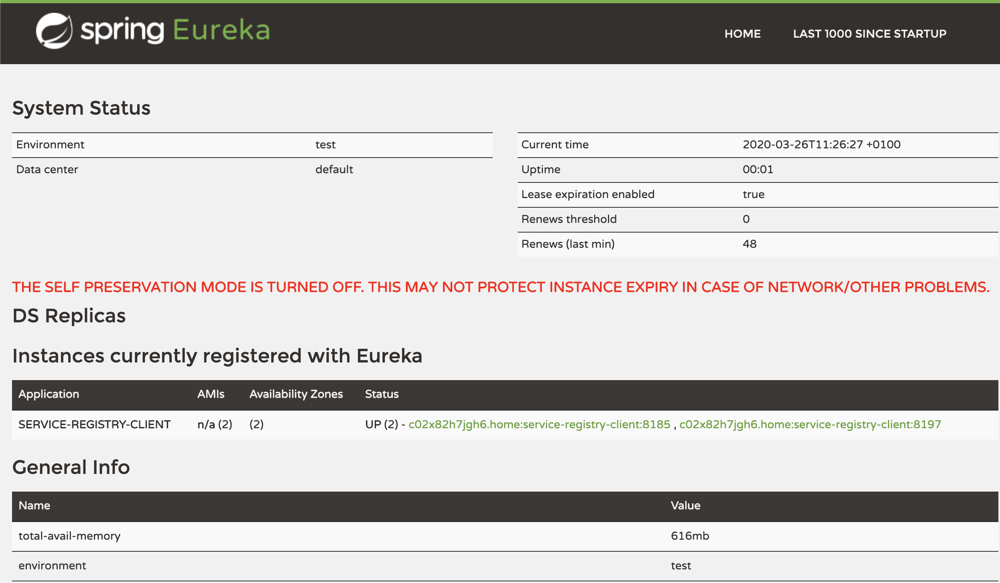

# Spring Netflix Eureka

This repository contains samples and configuration guidance for Spring Netflix Eureka, a service registry.
Especially, it shows how Eureka can be configured to run in a standalone mode, and in a PaaS Offering like Cloud Foundry.
For further information and samples on Eureka, also visit [Spring-Netflix-Cloud](https://github.com/e-qualities/Spring-Netflix-Cloud).

# Components of this Project

This project consists of the following components:

1. A Eureka server, located in [service-registry](./service-registry)
2. A Eureka client application, located in [service-registry-client](./service-registry-client)

The client application is configured to use a random port (in the range of 8100 to 8200) when it starts up, so you can spin up several client instances to test more complex scenarios.

# Running the Project

First build the project by executing the following on the root of the project:

´´´shell
mvn clean package
´´´

To run the project, you can start each module individually, by calling:

```shell
mvn spring-boot:run
```

**Note:** If you want to simulate clients whose process is killed ungracefully, you might want to start clients using 

```shell
java -jar servic-registry-client/target/service-registry-client-0.0.1-SNAPSHOT.jar
```

# Running Eureka in Standalone Mode

Eureka servic registry is a powerful tool that constitutes an integral part of a cloud-native service landscape.  
As such, Eureka usually needs to be highly available, scale well and be resilient against network outages.  

Eureka therefore is able to run in cluster mode, where multiple Eureka server instances form a peer-to-peer network exchanging information about registered services and balancing load between one another. This is great, if your service landscape is spread across data centers and network boundaries - where usually there is a risk of network failure.

In scenarios, where you are running a single Eureka server instance in a managed environment, e.g. Cloud Foundry, having a cluster of Eureka servers is maybe not what you need. In that case, a simpler - standalone - setup may be preferred.

Here, we will focus on that standalone setup, and show configurations that allow you to control your service landscape in a fine-grained way.  
Especially, we will show how Eureka needs to be configured to provide a realistic view of your service landscape, even if service instances are killed or ungracefully shut down.

## The Sample Scenario

With the following setup we simulate the following:

1. There is a single Eureka server instance running (locally or in Cloud Foundry).
1. There are two service clients connected.
1. One service client is shut down ungracefully, i.e. its process is killed.
1. We want Eureka to reflect the demise of the killed service registry with a reasonably small delay (in the order of a few seconds).

This scenario is a typical problem statement, when running Eureka on Cloud Foundry, where every service client is run in a (Docker-like) container and can be ungracefully removed whenever it is re-deployed. In such a case, you do not want Eureka to keep on displaying the dead client instance in its registry for longer than a few seconds after its demise.

## Running the Sample Scenario

To run the scenario above, proceed as follows:

1. Build the entire project
1. Start the service registry, by executing: 
   `java -jar service-registry/target/service-registry-0.0.1-SNAPSHOT.jar`
1. Open a different shell and start **two** instances of service-registry-client using: 
   `java -jar service-registry-client/target/service-registry-client-0.0.1-SNAPSHOT.jar &`
   Note the `&` character at the end of the service registry client startup command. This starts the client in a new process and sends it into the background, allowing you to type the same command again to spin up another instance.
1. With all instances running, open `http://localhost:8761` and confirm that both service registry client instances are running and have successfully registered.
   

Now that all instances are up and registered, we can simulate a network outage or a service being killed as follows:

1. Type `ps` in your command shell to see a list of running processes:
   ```
   71419 ttys011    0:35.33 java -jar service-registry/target/service-registry-0.0.1-SNAPSHOT.jar
   71520 ttys012    0:00.20 -bash
   68320 ttys013    0:01.28 -bash
   71420 ttys013    0:32.19 java -jar service-registry-client/target/service-registry-client-0.0.1-SNAPSHOT.jar
   71465 ttys013    0:28.58 java -jar service-registry-client/target/service-registry-client-0.0.1-SNAPSHOT.jar
   ```
1. Now (brutally) kill one of the service registry client processes, typing `kill -9 <number of process>`, e.g. `kill -9 71420`.
1. Open `http://localhost:8761` again, and refresh the view. After around 5 - 10 seconds, you should see one of the instances disappear from the registry list.

## How To Achieve This Behavior

The scenario described above seems straight-forward when you try it out. Configuring Eureka the right way to achieve that behavior is surprisingly hard to find out. 

The following configurations of Eureka are relevant for the shown setup:

**Eureka Standalone Mode** - in the sample, Eureka runs in standalone mode, meaning that there is only one instance of Eureka, that is configured **not** to form a cluster. The configurations that run Eureka in standalone mode are:

```yaml
eureka:
  instance:
    hostname: ${vcap.application.uris[0]:localhost}
  client:    
    register-with-eureka: false
    fetch-registry: false
    service-url:
      defaultZone: http://${eureka.instance.hostname}:${server.port}/eureka
```

**Eureka Self-Preservation Turned Off** - Eureka has a self-preservation mode, which by default is turned on to improve resiliency against temporary network outages and to keep the system performance high. To understand the concept of self-preservation, you need to understand how Eureka works:

* Service clients send periodic heartbeat signals to Eureka, usually every 30 seconds (unless changed). A service is not available for discovery by clients until the service instance, the Eureka server, and the client all have the same metadata in their local cache (so it could take 3 heartbeats).
* Heartbeats are an indicator of service availability and whenever a client does not send its heartbeat on time there is a potential that the service is down.
* Eureka keeps a list of registered services (together with their health information) and Eureka service clients pull and cache that information.
* Depending on the heartbeat frequency, the number of services and at what time services register it can take several minutes until a consistent landscape view is availble.
* In case of a (short-term) network outage, no heartbeats would reach Eureka for several minutes, yet the services might still all be available.
  The primitive approach of bit by bit removing all service instances that no longer send heartbeats would empty the entire registry, a complete invalidation of all client caches when the network is back up and an entire re-establishment of a consistent landscape view.  
  This is particularly painful, if the network outage is (as usually the case) of short duration.

Self-preservation mode avoids this, by keeping an eye on the number of heartbeats in total. If - more or less at the same time - the total number of heartbeats falls below a (configurable)) renewal threshold, Eureka will assume that this is due to a (short-term) network outage, and **stops eviction of service instances from its registry**. 

In other words: Eureka tries to stay cool, and not remove all services that no longer send heartbeats but hopes that in a few minutes, when the network is back up again, the services will keep sending heartbeats again.

For the time of the presumed network outage, the registry information is in an **inconsistent state**, which is only a marginal problem, if all service clients that get information from Eureka are coded in a resilient way and can deal with the fact that a service that is advertised as being `UP` by Eureka is temporarily not available.

Why turn self-preservation off? Self-preservation is a great tool, when Eureka is clustered and spanning several network boundaries.  
For a setup where all Eureka instances are running in the same network (e.g. on Cloud Foundry) it may be more important to have an accurate and consistent view of the service landscape than having resiliency against a network outage. In such cases, self-preservation is a problem, since it stops service instances that are no longer available (e.g. because they have crashed) to be evicted from the service registry.

The configuration to turn self-preservation off in Eureka is:

```yaml
eureka.server.enable-self-preservation: false # Default: true
```

**Client Lease Expiration** - Eureka clients register with Eureka and receive a _lease_ in return. The lease has an expiration duration (configured in the Eureka _service client instance_) and every heartbeat sent to Eureka renews that lease. Eureka will evict the service when it no longer receives a heartbeat only when the lease has expired.  
Therefore, _lease expiration duration has an impact on how soon the service will be gone from the registry_.  
In our scenario above, clients send a heartbeat every two seconds (30s in production), and have configured a lease expiration duration of 5 seconds.

The configuration to set the lease expiration duration is:

```yaml
eureka.instance.lease-expiration-duration-in-seconds: 5 # Default: 90 
```
❗️Note, that this needs to be configured in the service _client_, not Eureka server!

**Service Eviction Timer** - Eureka has a task that periodically scans the registry for services that no longer send heartbeats and whose lease has expired. That task then removes the service from the registry. By default, the task runs every 60 seconds, but it can be lowered to have expired services disappear faster.  
Therefore, _the service eviction timer interval has an impact on how soon the service will be gone from the registry_.  
In our sample above, the timer was set to 2 seconds.

The configuration to set service eviction timer interval is:

```yaml
eureka.server.eviction-interval-timer-in-ms: 2000 # Default: 60000
```

**Renewal Threshold** - The renewal threshold is a (configurable) _percentage_ that is used by Eureka to determine when to enable self-preservation mode.  
The moment the number of renewal heartbeats falls below the specified percentage, Eureka will assume a network outage and go into self-preservation mode (unless explicitly switched off). When Eureka's self-preservation mode is explicitly disabled, the threshold is set to 0 automatically and is not considered.

The configuration to set the renewal threshold is:

```yaml
eureka.server.renewal-percent-threshold: 0.5 # 50%, Default: 0.85
```

**Current Absolute Renewal Threshold** - Since the given renewal threshold is a percentage, Eureka continually needs to calculate an absolute number of that threshold. The absolute current renewal threshold depends on the _expected renewal interval used by clients_ and the number of clients that are currently registered. The current renewal threshold is measured in renewals per minute. As a rule of thumb, the following equation can be used:

```
current renewal threshold = (60s / expected-client-renewal-interval-seconds) * renewal-percent-threshold * current number of client instances
```

**Renewal Threshold Update Interval** - The current absolute renewal threshold depends on the number of clients that are registered. Hence, it is continuously and periodically adjusted. The interval in which re-calculation and adjustments take place can be configured and can have an impact on the self-preservation behavior of Eureka server. If self-preservation is disabled, this value is meaningless as the current renewal threshold will always be 0.

The configuration to set the renewal threshold update interval is:

```yaml
eureka.server.renewal-threshold-update-interval-ms: 2000 # Default: 15 * 60 * 1000
```

**Expected Client Renewal Interval** - Eureka server needs to make assumptions about how often clients will send a heartbeat. The very simple solution is that Eureka clients and servers use the same heartbeat configuration. On the server, you set the _expected_ client heartbeat interval. On the client, you then have to make sure you stick to that expectation.

The configuration to set the expected client renewal interval on Eureka server is:

```yaml
eureka.server.expected-client-renewal-interval-seconds: 3 # Default: 30
```

**Actual Client Renewal Interval** - The expected client renewal interval configured on Eureka server needs to match the interval that is actually configured on the clients. In particular this means that _all clients share the same heartbeat rate_! 

The configuration to set the client's renewal interval is:

```yaml
eureka.instance.lease-renewal-interval-in-seconds: 2 # Default: 30
```
❗️Note, that this needs to be configured in the service _client_, not Eureka server!

## Complete Configurations

### Eureka Server Configuration
[See code](./service-registry/src/main/resources/application.yml)

```yaml
# Actuator Endpoint Configurations
info: # /actuator/info
  app:
    description: "The service registry of the application."

spring:
  application:
    name: service-registry

server:
  port: ${PORT:8761}
 
eureka:
  # For documentation of server configs, see: https://github.com/Netflix/eureka/blob/master/eureka-core/src/main/java/com/netflix/eureka/EurekaServerConfig.java, 
  # For default values, see:                  https://github.com/Netflix/eureka/blob/f660f788e8309621186deee6ffe9425ab8243056/eureka-core/src/main/java/com/netflix/eureka/DefaultEurekaServerConfig.java 
  server:
    # Switch off self-preservation. Will turn lease expiration on and evict all instances which no longer sent a heartbeat and whose lease has expired.
    # Self-preservation is desirable for Eureka clusters and where network outages (e.g. between data centers) could be possible.
    # Note: the lease validity / expiration is configured in the Eureka _client_ instances (see eureka.instance.lease-expiration-duration-in-seconds).
    # See: https://github.com/Netflix/eureka/wiki/Server-Self-Preservation-Mode
    # See: https://www.baeldung.com/eureka-self-preservation-renewal
    enable-self-preservation: false
  
    # Make sure this is is set to the same value as the lease renewal interval in Eureka _client_ instances (or slightly higher)
    # This value is relevant for Eureka's calculation of the 'current renewal threshold'.
    # Specifically, the following equation is used: current renewal threshold = (60s / expected-client-renewal-interval-seconds) * renewal-percent-threshold * current number of client instances.
    # In this case: 
    # - for one registered client: 60 / 3 * 0.5 * 1 = 10.
    # - for two registered clients: 60 / 3 * 0,5 * 2 = 20.
    # As soon as two clients are connected: 
    expected-client-renewal-interval-seconds:  3

    # The interval in which the instance eviction task scans for instances with expired leases.
    # Given in milliseconds.
    eviction-interval-timer-in-ms:             2000

    # The cadence of calculating / adapting a new renewal threshold, i.e. how frequently a new threshold is calculated.
    # The renewal threshold is used to distinguish, when Eureka should go into self-preservation mode 
    # (if eureka.server.enable-self-preservation: true). If less heartbeats than the threshold are received, Eureka assumes
    # a network outage and protects itsel from evicting all service instances - assuming that the outage is over soon, and
    # services are still there to continue sending heartbeats.
    renewal-threshold-update-interval-ms:      2000 # Default: 15 * 60 * 1000

    # The minimum renewal threshold, in percent. If less heartbeats than the given percentage are received per minute
    # Eureka will go into self-preservation mode (if eureka.server.enable-self-preservation: true) and stop evicting
    # service instances with expired leases that no longer send heartbeats - assuming there is only a temporal network
    # outage.
    renewal-percent-threshold:                 0.5  # Default: 0.85

  instance:
    hostname:                                  ${vcap.application.uris[0]:localhost}
  client:    
    register-with-eureka: false
    fetch-registry: false
    service-url:
      defaultZone: http://${eureka.instance.hostname}:${server.port}/eureka

management:
  endpoints:
    web.exposure.include: "*"    # expose all actuator web endpoints
  endpoint:
    refresh.enabled: true        # enable /actuator/refresh endpoint.
    health.show-details: always

--- # For Cloud Foundry Deployment
spring.profiles: cloud

eureka:
  server:
    # make sure this is is set to the same value as the lease renewal interval in clients (or slightly higher)
    expected-client-renewal-interval-seconds: 30
  instance:
    non-secure-port-enabled:           false
    secure-port-enabled:               true
    secure-port:                       443
```

### Eureka Client Configuration
[See code](./service-registry-client/src/main/resources/application.yml)

```yaml
---
spring:
  application:
    name: service-registry-client

server:
  port: ${random.int(8100,8200)}

eureka:
  instance:
    # Request a lease with a validity of 5 seconds. If until then the
    # lease has not been renewed, it expires and the Eureka server can evict it.
    # Default: 90s
    lease-expiration-duration-in-seconds: 5

    # The cadence of lease renewal, i.e. how often a heartbeat is sent to Eureka server.
    # In this case every 2 seconds. Use this only for development / debugging. In production use the ... 
    # Default: 30s
    lease-renewal-interval-in-seconds:    2

    # Instance information, URLs registered in Eureka.
    homePageUrl:          https://${vcap.application.uris[0]:localhost}/
    statusPageUrl:        https://${vcap.application.uris[0]:localhost}/actuator/info 
    healthCheckUrl:       https://${vcap.application.uris[0]:localhost}/actuator/health
    secureHealthCheckUrl: https://${vcap.application.uris[0]:localhost}/actuator/health
    hostname:             ${vcap.application.uris[0]:localhost}
  client: 
    serviceUrl:
      defaultZone: http://localhost:8761/eureka

# Expose all actuator / management endpoints. Don't use this in production.
management.endpoints.web.exposure.include: "*"

# Expose all health information, also from Hystrix, Eureka and others.
# See: https://docs.spring.io/spring-boot/docs/2.1.3.RELEASE/reference/htmlsingle/#production-ready-health 
management.endpoint.health.show-details: always

--- # For Cloud Foundry Deployment
spring.profiles: cloud

server:
  port: ${PORT:0}

eureka:
  client: 
    serviceUrl:
      defaultZone: ${eureka-server-url}   # URL as given in manifest.yml environment variable eureka-server-url.
  instance: 
    # Use proper default of 30 seconds in production.
    lease-renewal-interval-in-seconds: 30
    # Disable non-secure port in CF
    nonSecurePortEnabled: false
    # Enable secure port (https)
    securePortEnabled:    true
    # Use standard HTTPS port
    securePort:           443
```

# Deployment to Cloud Foundry

The modules of this project can be deployed to Cloud Foundry individually. Each module contains the following files:

* `manifest.yml` - This is where the deployable application is described.
* `manifest-variables.yml` - This is where outsourced variables are declared and resolved from.

To deploy to Cloud Foundry simply follow these steps:

1. Build the module using `mvn clean package`
1. Deploy the module to CF using `cf push --vars-file manifest-variables.yml` 

# Debugging Eureka Behavior

Eureka is a powerful tool that does a great job out of the box. Configurations can become complex, however. 
This is made particularly difficult, since sometimes the expected behavior cannot be observed immediately. 
Due to the fact that the processes depend on client and server, it is often a matter of best-case / worst-case timeing.

For example, in the worst case, it takes 3 heartbeats before a service is available in Eureka for a client to find and consume it.

Luckily, there are a few things that can help introspect into what's going on inside Eureka. These are described here.

## Spring Boot Actuator 

Spring Boot Actuator is a framework that provides a variety of REST endpoints to introspect and control a running Spring Boot application.

To add Actuator to Eureka, you need to add the following dependency to Eureka's `pom.xml`:

```xml
<dependency>
  <groupId>org.springframework.boot</groupId>
  <artifactId>spring-boot-starter-actuator</artifactId>
</dependency>
```

Additionally, you need to add the following configurations in Eureka's `application.yml`:

```yaml
management:
  endpoints:
    web.exposure.include: "*"    # expose all actuator web endpoints
  endpoint:
    refresh.enabled: true        # enable /actuator/refresh endpoint.
    health.show-details: always
```

With these additions made, you can start Eureka and have a variety of endpoints available, see: http://localhost:8761/actuator/.

One endpoint that can be particularly helpful is the `/actuator/configprops` endpoint.
Here you see which kind of configuration properties exist and which value they currently have.
Eureka actually has some lesser-known properties (that additionally are poorly documented) - and you can find them there, too.

## Service Registry Client

The service registry client provided as part of this project can also be used for debugging.

It acts as a service registry client and provides a REST endpoint that can be used to look up service instance information in Eureka.

Once service registry client is running, you can access its main page under: http://localhost:<random port>/.  
Inspect the log output on startup for which random port service registry client was bound to.

Using the `/lookup/<service id>` endpoint, you can lookup registry information for any service with the given ID.  
In particular, accessing `http://localhost:<port>/lookup/service-registry-client` will show service instance information of all instances of the service registry client itself.

Inspecting this information can also be helpful for debugging and for better understanding of what is going on behind the scenes.

A typical output could look as follows:

```json
[
  {
    uri: "http://localhost:8141",
    port: 8141,
    host: "localhost",
    scheme: "http",
    serviceId: "SERVICE-REGISTRY-CLIENT",
    instanceId: "mymachine.home:service-registry-client:8185",
    secure: false,
    instanceInfo: {
      instanceId: "mymachine.home:service-registry-client:8185",
      app: "SERVICE-REGISTRY-CLIENT",
      appGroupName: null,
      ipAddr: "192.168.1.104",
      sid: "na",
      homePageUrl: "https://localhost/",
      statusPageUrl: "https://localhost/actuator/info",
      healthCheckUrl: "https://localhost/actuator/health",
      secureHealthCheckUrl: "https://localhost/actuator/health",
      vipAddress: "service-registry-client",
      secureVipAddress: "service-registry-client",
      countryId: 1,
      dataCenterInfo: {
        @class: "com.netflix.appinfo.InstanceInfo$DefaultDataCenterInfo",
        name: "MyOwn"
      },
      hostName: "localhost",
      status: "UP",
      overriddenStatus: "UNKNOWN",
      leaseInfo: {
        renewalIntervalInSecs: 2,
        durationInSecs: 5,
        registrationTimestamp: 1585231999555,
        lastRenewalTimestamp: 1585233011113,
        evictionTimestamp: 0,
        serviceUpTimestamp: 1585231999556
      },
      isCoordinatingDiscoveryServer: false,
      metadata: {
        management.port: "8141"
      },
      lastUpdatedTimestamp: 1585231999557,
      lastDirtyTimestamp: 1585231999460,
      actionType: "ADDED",
      asgName: null
    },
    metadata: {
      management.port: "8141"
    }
  }
]
```

Especially have a look at the `leaseInfo` section, which contains the configured `durationInSecs` as well as `renewalIntervalInSecs`.

# Eureka with Self-Preservation Turned On

In this branch we described a standalone Eureka setup, where self-preservation was explicitly turned off.  
If you are interested in a scenario with self-preservation turned on, please see this [excellent article by Baeldung](https://www.baeldung.com/eureka-self-preservation-renewal).

# References

* [Baeldung - Guide to Eureka Self Preservation and Renewal](https://www.baeldung.com/eureka-self-preservation-renewal)
* [Spring Cloud Netflix Eureka Documentation](https://cloud.spring.io/spring-cloud-netflix/reference/html/)
* [Spring-Netflix-Cloud](https://github.com/e-qualities/Spring-Netflix-Cloud)
* Interesting Eureka Github Issues: [1](https://github.com/spring-cloud/spring-cloud-netflix/issues/3652) | [2](https://github.com/spring-cloud/spring-cloud-netflix/issues/380) | [3](https://github.com/spring-cloud/spring-cloud-netflix/issues/1312) | [4](https://github.com/spring-cloud/spring-cloud-netflix/issues/1844)
* [Eureka Server Configurations](https://github.com/Netflix/eureka/blob/master/eureka-core/src/main/java/com/netflix/eureka/EurekaServerConfig.java)
* [Eureka Server Configuration Default Values](https://github.com/Netflix/eureka/blob/f660f788e8309621186deee6ffe9425ab8243056/eureka-core/src/main/java/com/netflix/eureka/DefaultEurekaServerConfig.java)
* Lease Expiration: [isLeaseExpirationEnabled](https://github.com/Netflix/eureka/blob/cefadab13ef8ddfa2d702cd07ad9a4a393ff94f4/eureka-core/src/main/java/com/netflix/eureka/registry/PeerAwareInstanceRegistryImpl.java#L474) | [numberOfRenewsPerMinThreshold](https://github.com/Netflix/eureka/blob/master/eureka-core/src/main/java/com/netflix/eureka/registry/AbstractInstanceRegistry.java#L1189)
* [PeerAwareInstanceRegistryImpl](https://github.com/Netflix/eureka/blob/master/eureka-core/src/main/java/com/netflix/eureka/registry/PeerAwareInstanceRegistryImpl.java)


